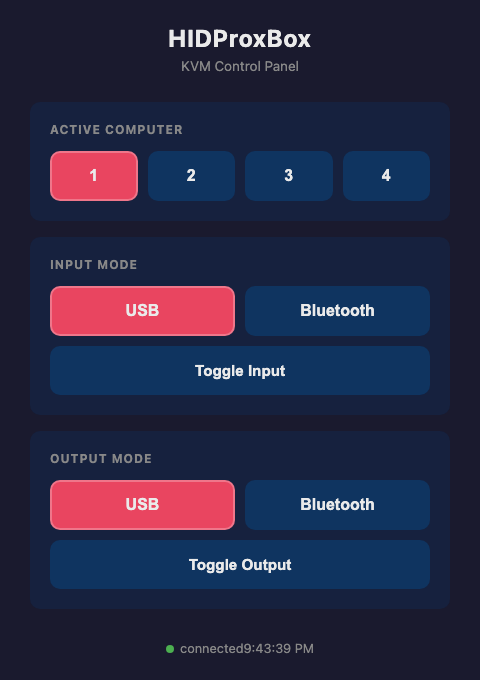
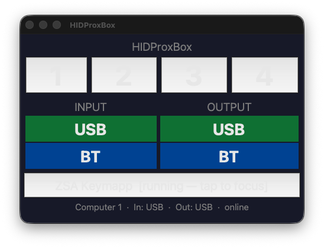

# HIDProxBox

A 4-port Bluetooth/USB HID KVM proxy built on a Raspberry Pi and four CH552T microcontrollers. HIDProxBox sits between your input devices (a physical USB keyboard or a Bluetooth keyboard) and up to four computers, letting you switch between hosts instantly with a button press — no software installation required on any of the target computers.

---

## What It Does

- **Switch between 4 computers** with dedicated selector buttons — all computers stay USB-connected at all times
- **Accept input from a physical USB keyboard** plugged into the Pi, or from **any Bluetooth keyboard**
- **Toggle keyboard input source** (USB ↔ BT) with a single button
- **Output via USB** (the Pi talks to each computer through an individual CH552T HID device) **or via Bluetooth** (the Pi presents itself as a wireless keyboard directly to the selected computer)
- **Hold a button to pair** — one hold gesture pairs an upstream BT keyboard; another pairs the Pi itself as a BT keyboard to the active computer
- **LED feedback** — six indicator LEDs show which computer is active, which input source is live, and which output mode is in use
- **Web control panel** — a built-in HTTP server at `http://<pi-ip>:8080` lets you switch computers and toggle modes from any browser on your network
- **Local touchscreen display** — an optional tkinter GUI (`display.py`) runs on a Pi-attached touchscreen, mirroring the web panel with one-tap computer switching and a ZSA Keymapp launcher

---

## Table of Contents

1. [Architecture](#architecture)
2. [Hardware Bill of Materials](#hardware-bill-of-materials)
3. [Assembly & Wiring](#assembly--wiring)
   - [Overview diagram](#overview-diagram)
   - [GPIO buttons](#gpio-buttons-active-low)
   - [GPIO LEDs](#gpio-leds-active-high)
   - [CH552T units](#ch552t-units-one-per-computer)
4. [Software Installation](#software-installation)
5. [CH552T Firmware](#ch552t-firmware)
6. [Configuration](#configuration)
7. [Running the Daemon](#running-the-daemon)
8. [Web Control Panel](#web-control-panel)
9. [Local Touchscreen Display](#local-touchscreen-display)
10. [Operation](#operation)
11. [HID Macros](#hid-macros)
12. [Troubleshooting](#troubleshooting)
13. [Project Structure](#project-structure)
14. [Contributing](#contributing)
15. [License](#license)

---

## Architecture

```
┌─────────────────────────────────────────────────────────────────┐
│                        Raspberry Pi                             │
│                                                                 │
│  ┌────────────┐   ┌───────────┐   ┌──────────────────────────┐ │
│  │ usb_kbd.py │   │bt_listener│   │      gpio_watcher.py     │ │
│  │ (evdev)    │   │   .py     │   │ 4× computer select btns  │ │
│  │ USB kbd in │   │ BT kbd in │   │ BT-input btn (s/l press) │ │
│  └─────┬──────┘   └─────┬─────┘   │ BT-output btn(s/l press)│ │
│        │  source="usb"  │  source="bt"   └──────┬───────────┘ │
│        └────────────────┴────────────────────────┤             │
│                                                   ▼             │
│                              ┌────────────────────────────┐    │
│                              │         router.py          │    │
│                              │  active_computer : 1–4     │    │
│                              │  input_mode : usb | bt     │    │
│                              │  output_mode: usb | bt     │    │
│                              └──────────┬─────────────────┘    │
│                                         │                       │
│                    ┌────────────────────┴──────────────────┐   │
│                    ▼  output_mode=usb                       ▼   │
│          ┌─────────────────┐                  ┌─────────────────┐│
│          │  hid_writer.py  │                  │  bt_output.py   ││
│          │ 4× serial ports │                  │ Pi as BT HID    ││
│          └──┬──┬──┬──┬─────┘                  │ keyboard device ││
│             │  │  │  │                         └────────┬────────┘│
└─────────────┼──┼──┼──┼──────────────────────────────────┼────────┘
              │  │  │  │  /dev/ttyUSB0–3                   │ Bluetooth
       ┌──────┘  │  │  └──────┐                            │
       ▼         ▼  ▼         ▼                            ▼
  ┌────────┐ ┌──────┐ ┌──────┐ ┌────────┐        (selected computer)
  │CH552T 1│ │  #2  │ │  #3  │ │CH552T 4│
  │USB HID │ │      │ │      │ │USB HID │
  └───┬────┘ └──┬───┘ └──┬───┘ └───┬────┘
      │         │         │         │  USB cables (always plugged in)
      ▼         ▼         ▼         ▼
  Computer1  Computer2  Computer3  Computer4
```

The daemon also starts a **web UI** thread (`web_ui.py`) that serves a browser-based control panel. The optional **display** process (`display.py`) connects to this same HTTP API over localhost.

### File Overview

| File | Role |
|------|------|
| `config.py` | Single source of truth — serial ports, GPIO pins, button actions, LED pins, BT settings |
| `router.py` | Central state machine; drains the shared report queue and dispatches to the right output sink |
| `usb_kbd.py` | Reads a physical USB keyboard via evdev; converts Linux key events to 8-byte HID reports |
| `bt_listener.py` | Bluetooth HID host — receives HID reports from a paired BT keyboard |
| `bt_output.py` | Bluetooth HID device — makes the Pi appear as a wireless keyboard to computers |
| `hid_writer.py` | USB output sink — manages four CH552T serial connections, routes reports to the active one |
| `gpio_watcher.py` | Button input with short/long press detection; drives all six indicator LEDs |
| `web_ui.py` | Lightweight HTTP control panel — serves a browser UI and a JSON status/control API |
| `display.py` | Optional local touchscreen GUI — polls web_ui and drives a tkinter interface |
| `daemon.py` | Entry point — wires all subsystems, installs signal handlers, runs the health watchdog |
| `gadget_setup.sh` | Optional: configures Linux USB gadget mode (keyboard + mouse on /dev/hidg0/1) |
| `firmware/ch552t_hid_proxy/ch552t_hid_proxy.ino` | Arduino sketch for each CH552T unit |

---

## Hardware Bill of Materials

| Qty | Item | Notes |
|-----|------|-------|
| 1 | Raspberry Pi Zero 2W **or** Pi 4 | Pi 4 preferred — multiple hardware UARTs, more USB ports |
| 4 | CH552T microcontroller (breakout or bare chip) | [Available on LCSC](https://lcsc.com/search?q=CH552T) |
| 4 | USB-serial adapter (CP2102 / CH340) | One per CH552T; provides /dev/ttyUSB0–3 |
| 4 | USB-A to USB-C (or USB-B) cable | One per computer — always stay plugged in |
| 6 | Momentary push-buttons (SPST NO) | Active-low; any 6 mm tactile switch works |
| 6 | LEDs (any color) + 220 Ω resistors | Indicator LEDs; one per button |
| 2 | LEDs per CH552T + 220 Ω resistors | Active LED (P3.4) and optional status LED (P1.4) per unit |
| — | 22 Ω resistors × 8 | USB D+/D− series resistors (2 per CH552T unit) |
| — | 3.3 V power rail | CH552T is a 3.3 V part; USB-serial adapters typically provide 3.3 V |
| — | Enclosure of your choice | |
| 1 | 3.5–7″ Pi-compatible touchscreen (optional) | For `display.py` local GUI |

---

## Assembly & Wiring

### Overview Diagram

The diagram below shows the full assembly at a glance. Each CH552T lives between the Pi (via a USB-serial adapter) and one target computer (via USB). All button/LED wiring is direct GPIO.

```
                        ╔═══════════════════════════════╗
                        ║         Raspberry Pi          ║
                        ║                               ║
  USB kbd ──────────────║─ USB-A                        ║
                        ║                               ║
  BT kbd (wireless) ────║─ hci0 (onboard BT)            ║
                        ║                               ║
  Buttons ─────────────►║ BCM 4,17,27,22 (computers)   ║
  (to GND)              ║ BCM 5 (BT input)              ║
                        ║ BCM 6 (BT output)             ║
                        ║                               ║
  LEDs ◄────────────────║ BCM 12,16,20,21 (computers)   ║
  (to GND via 220Ω)     ║ BCM 24 (BT input active)      ║
                        ║ BCM 25 (BT output active)     ║
                        ║                               ║
                        ║ USB ports:                    ║
                        ║  /dev/ttyUSB0 ─────────►──────║──► CH552T #1 ──USB──► Computer 1
                        ║  /dev/ttyUSB1 ─────────►──────║──► CH552T #2 ──USB──► Computer 2
                        ║  /dev/ttyUSB2 ─────────►──────║──► CH552T #3 ──USB──► Computer 3
                        ║  /dev/ttyUSB3 ─────────►──────║──► CH552T #4 ──USB──► Computer 4
                        ║                               ║
                        ║ Touchscreen (optional):        ║
                        ║  DSI / HDMI ──► display.py    ║
                        ╚═══════════════════════════════╝
```

---

### GPIO Buttons (active-low)

Each button connects between a BCM GPIO pin and GND. The Pi's internal pull-up holds the pin HIGH at rest; pressing pulls it LOW.

```
  Pi BCM pin ──┬── Button ── GND
               │
            (pull-up)
```

| BCM Pin | Button Function | Short Press | Long Press |
|---------|-----------------|-------------|------------|
| 4 | Computer 1 | Select computer 1 | Select computer 1 |
| 17 | Computer 2 | Select computer 2 | Select computer 2 |
| 27 | Computer 3 | Select computer 3 | Select computer 3 |
| 22 | Computer 4 | Select computer 4 | Select computer 4 |
| 5 | BT keyboard | Toggle USB ↔ BT input | Pair BT keyboard to Pi |
| 6 | BT output | Toggle USB ↔ BT output | Pair Pi as BT keyboard to active computer |

---

### GPIO LEDs (active-high)

Each LED connects from a BCM pin through a 220 Ω current-limiting resistor to the LED anode, with the cathode to GND.

```
  Pi BCM pin ──── 220 Ω ──── LED (+) ──── LED (−) ──── GND
```

| BCM Pin | Indicator |
|---------|-----------|
| 12 | Computer 1 active |
| 16 | Computer 2 active |
| 20 | Computer 3 active |
| 21 | Computer 4 active |
| 24 | BT keyboard input active |
| 25 | BT output mode active |

---

### CH552T Units (one per computer)

Each CH552T unit needs:
- **UART** from a CP2102/CH340 USB-serial adapter on the Pi (TX/RX/GND/3V3)
- **USB D+/D−** to the target computer (with 22 Ω series resistors)
- **Two optional LEDs** for active and status indication

**Single CH552T wiring (repeat × 4, incrementing ttyUSB number):**

```
┌──────────────────────────────────────────────────────────────┐
│                       CH552T Unit #1                         │
│                                                              │
│  Pi /dev/ttyUSB0 TX  ──────────  P3.0 (RXD1)               │
│  Pi /dev/ttyUSB0 RX  ──────────  P3.1 (TXD1)               │
│  Pi GND              ──────────  GND                        │
│  Pi 3.3V             ──────────  VCC                        │
│                                                              │
│  P3.4 ──── 220 Ω ──── ACTIVE LED (+) ──── LED (−) ──── GND │
│            (solid on = computer selected; off = standby)     │
│                                                              │
│  P1.4 ──── 220 Ω ──── STATUS LED (+) ──── LED (−) ──── GND │
│            (blinks on valid frame; double-blink on error)    │
│                                                              │
│  USB D+  ──── 22 Ω ──────────── Computer 1 USB D+          │
│  USB D−  ──── 22 Ω ──────────── Computer 1 USB D−          │
│  GND     ──────────────────────  Computer 1 USB GND         │
│  VBUS    ──────────────────────  Computer 1 USB VBUS (5V)   │
│                          (VBUS is for detection only —       │
│                           CH552T is powered from Pi 3.3V)   │
└──────────────────────────────────────────────────────────────┘
```

Repeat the above for units #2–#4, substituting `/dev/ttyUSB1`, `ttyUSB2`, `ttyUSB3` and `Computer 2`–`4`.

> **Voltage note:** CH552T is a 3.3 V part. The Raspberry Pi GPIO pins and USB-serial adapters operating at 3.3 V need no level shifter. **Do not connect a 5 V UART directly.**

#### CH552T LED Behavior Summary

| LED | Pin | Behavior |
|-----|-----|----------|
| Active LED | P3.4 (active-low) | Solid ON = this computer is the selected KVM target; OFF = standby |
| Status LED | P1.4 (active-low, optional) | Single blink = valid frame received; double-blink = checksum error |

On power-up the firmware blinks the active LED three times to confirm it is running.

---

## Software Installation

### 1. Prepare the Raspberry Pi

Flash Raspberry Pi OS Lite (64-bit) and complete initial setup, then:

```bash
# Update system packages
sudo apt update && sudo apt upgrade -y

# System dependencies
sudo apt install -y \
  python3-pip python3-dbus python3-gi python3-tk \
  bluez bluetooth \
  wmctrl   # optional — needed for Keymapp window focus in display.py

# Python dependencies
pip3 install evdev pyserial pybluez --break-system-packages
```

### 2. Enable required kernel modules (USB gadget mode — optional)

If you want the Pi itself to appear as a USB HID device (`gadget_setup.sh`), add to `/boot/firmware/config.txt` (path may be `/boot/config.txt` on older images):

```ini
dtoverlay=dwc2
enable_uart=1
```

Add to `/etc/modules`:

```
dwc2
libcomposite
```

> **Skip this step** if you only use the CH552T USB output path or Bluetooth output. USB gadget mode is an additional, optional output path.

### 3. Clone HIDProxBox

```bash
git clone https://github.com/andycrawford/HIDProxBox.git /opt/hidproxbox
cd /opt/hidproxbox
chmod +x gadget_setup.sh
```

### 4. Create required runtime directories

```bash
sudo mkdir -p /var/lib/hidproxbox   # BT pairing state
sudo mkdir -p /var/log              # log file (usually exists)
```

### 5. Configure

Edit `/opt/hidproxbox/config.py` to match your hardware (see [Configuration](#configuration)).

### 6. Flash CH552T firmware

See [CH552T Firmware](#ch552t-firmware) below.

### 7. Install and start the systemd service

```bash
sudo cp /opt/hidproxbox/hidproxbox.service /etc/systemd/system/
sudo systemctl daemon-reload
sudo systemctl enable hidproxbox
sudo systemctl start hidproxbox
sudo systemctl status hidproxbox
```

**Example `/etc/systemd/system/hidproxbox.service`:**

```ini
[Unit]
Description=HIDProxBox KVM Daemon
After=network.target bluetooth.target

[Service]
Type=simple
ExecStartPre=/usr/bin/bash /opt/hidproxbox/gadget_setup.sh up
ExecStart=/usr/bin/python3 /opt/hidproxbox/daemon.py --foreground
ExecStopPost=/usr/bin/bash /opt/hidproxbox/gadget_setup.sh down
Restart=on-failure
RestartSec=5

[Install]
WantedBy=multi-user.target
```

> Remove the `ExecStartPre` / `ExecStopPost` lines if you are not using USB gadget mode.

---

## CH552T Firmware

Each of the four CH552T units runs the same Arduino sketch. Flash each one individually before wiring them into the system.

### Install ch55xduino in Arduino IDE

1. Open Arduino IDE → **File → Preferences**
2. Add this URL to *Additional boards manager URLs*:
   ```
   https://raw.githubusercontent.com/DeqingSun/ch55xduino/master/package_ch55xduino_mcs51_index.json
   ```
3. **Tools → Board → Boards Manager**, search `ch55x`, install **ch55xduino**.

### Board settings

| Setting | Value |
|---------|-------|
| Tools → Board | CH55x boards → **CH552** |
| Tools → Clock Source | **16 MHz (internal)** |
| Tools → Upload Method | **USB (bootloader)** |
| Tools → USB Settings | **USER CODE w/ 148B USB ram** |

### Enter bootloader mode

For a **bare CH552T chip**, hold the BOOT pin (P3.6) LOW while applying power, then release — the chip enumerates as a bootloader device.

For a **CH552T on a breakout board**, there is typically a BOOT button — hold it while plugging in USB, then release.

### Upload

Open `firmware/ch552t_hid_proxy/ch552t_hid_proxy.ino` and click **Upload**. Repeat for each of the four units. All four units use identical firmware; they are distinguished only by which serial port and computer they are physically wired to.

### Verify

After flashing and reconnecting to the computer's USB port, the active LED (P3.4) blinks three times to confirm the firmware is running. Check Device Manager (Windows) or `lsusb` (Linux/macOS) to confirm the CH552T enumerates as a USB HID keyboard/mouse.

### Serial Frame Protocol (reference)

The Pi speaks a simple framed binary protocol to each CH552T over UART at 115200 baud:

```
[0xAA] [TYPE] [LEN] [DATA × LEN bytes] [CHECKSUM]

CHECKSUM = XOR of TYPE ^ LEN ^ DATA[0] ^ … ^ DATA[N-1]
```

| TYPE | LEN | Payload |
|------|-----|---------|
| `0x01` | 8 | Keyboard: `[modifier, 0x00, key1..key6]` |
| `0x02` | 4 | Mouse: `[buttons, X, Y, wheel]` (signed int8) |
| `0x03` | 2 | Consumer (multimedia): `[usage_lo, usage_hi]` |
| `0x10` | 1 | Set-active LED: `0x01`=on, `0x00`=off |
| `0xFE` | 0 | Ping (no-op) |
| `0xFF` | 0 | Reset — release all keys/buttons |

---

## Configuration

Edit `/opt/hidproxbox/config.py`. Every tuneable parameter is documented inline. Key sections:

### Serial ports

```python
COMPUTERS: Dict[int, str] = {
    1: "/dev/ttyUSB0",
    2: "/dev/ttyUSB1",
    3: "/dev/ttyUSB2",
    4: "/dev/ttyUSB3",
}
```

Check which `ttyUSB*` node each adapter claims after plugging them in:

```bash
dmesg | grep ttyUSB
# or
ls -l /dev/ttyUSB*
```

For persistent naming regardless of plug-in order, create udev rules (see Troubleshooting).

### Bluetooth input

```python
BT_DEVICE_MAC   = ""   # "" = accept any paired BT keyboard; or set "AA:BB:CC:DD:EE:FF"
BT_AUTO_RECONNECT = True
BT_RECONNECT_DELAY = 5  # seconds between reconnect attempts
```

### Bluetooth output

```python
BT_OUTPUT_DEVICE_NAME = "HIDProxBox"  # name advertised when pairing
BT_PAIRING_TIMEOUT    = 60            # seconds discoverable while waiting to pair
BT_OUTPUT_PAIRS_FILE  = "/var/lib/hidproxbox/bt_output_pairs.json"
```

Paired computer MACs are saved in `BT_OUTPUT_PAIRS_FILE` so reconnect survives reboots.

### GPIO

```python
LONG_PRESS_S  = 1.5   # seconds held to trigger long-press action
GPIO_BOUNCE_MS = 50   # debounce window
```

### Web UI

```python
WEB_UI_ENABLED = True
WEB_UI_HOST    = "0.0.0.0"   # bind all interfaces; "127.0.0.1" for local-only
WEB_UI_PORT    = 8080
```

### Local display

```python
DISPLAY_ENABLED    = True
DISPLAY_FULLSCREEN = False   # True = kiosk/fullscreen mode
DISPLAY_WIDTH      = 480     # window width when not fullscreen
DISPLAY_HEIGHT     = 320     # window height when not fullscreen
DISPLAY_POLL_MS    = 250     # web_ui polling interval

KEYMAPP_CMD        = "keymapp"   # path to ZSA Keymapp binary
KEYMAPP_WINDOW_NAME = "Keymapp"  # window title for wmctrl/xdotool focus
```

### Logging

```python
LOG_LEVEL       = "INFO"
LOG_FILE        = "/var/log/hidproxbox.log"
LOG_MAX_BYTES   = 5 * 1024 * 1024   # rotate at 5 MB
LOG_BACKUP_COUNT = 3
```

---

## Running the Daemon

```bash
# Foreground (logs to stderr — useful when testing)
sudo python3 /opt/hidproxbox/daemon.py --foreground

# Background (writes to LOG_FILE)
sudo python3 /opt/hidproxbox/daemon.py

# Via systemd
sudo systemctl start hidproxbox
sudo systemctl status hidproxbox
sudo journalctl -u hidproxbox -f
```

The daemon starts these threads in order: Router → BTOutput → BTListener → USBKeyboard → GPIOWatcher → WebUI. The watchdog loop restarts the Router thread automatically if it ever dies.

---

## Web Control Panel

When `WEB_UI_ENABLED = True`, the daemon starts a built-in HTTP server at:

```
http://<pi-ip-address>:8080/
```

Open this URL in any browser on your local network to get a dark-themed control panel.



### Endpoints

| Method | Path | Description |
|--------|------|-------------|
| `GET` | `/` | HTML control panel |
| `GET` | `/api/status` | JSON: `{active_computer, input_mode, output_mode}` |
| `POST` | `/api/computer/<1–4>` | Select computer *n*; returns updated status JSON |
| `POST` | `/api/input/toggle` | Toggle USB ↔ BT input; returns updated status JSON |
| `POST` | `/api/output/toggle` | Toggle USB ↔ BT output; returns updated status JSON |

The HTML panel polls `/api/status` every second and highlights the active computer and mode buttons. A connection indicator turns red when the daemon cannot be reached.

> **Security note:** The web UI has no authentication. Bind to `127.0.0.1` in `config.py` if you want to prevent network access.

---

## Local Touchscreen Display

`display.py` is an optional standalone process that runs a tkinter GUI on a Pi-attached display (HDMI, DSI, or official touchscreen). It communicates with the daemon exclusively through the web UI HTTP API — it does not link against any daemon code directly.

**Hardware target:** 3.5–7″ Pi-compatible touchscreen at 480×320 or larger.

### Start the display

```bash
# Windowed (uses DISPLAY_WIDTH / DISPLAY_HEIGHT from config.py)
python3 /opt/hidproxbox/display.py

# Kiosk / fullscreen mode
python3 /opt/hidproxbox/display.py --fullscreen

# Press Escape to exit fullscreen
```

### What the display shows



| Region | Content |
|--------|---------|
| Row 1 — Tally buttons | Buttons 1–4; the active computer's button lights red. Tap to switch. |
| Row 2 — Input | USB / BT labels; the active source is highlighted green (USB) or blue (BT). |
| Row 2 — Output | USB / BT labels; the active output is highlighted green (USB) or blue (BT). |
| Row 3 — Keymapp | Purple button; tap to launch ZSA Keymapp (or focus its window if already running). |
| Status bar | Shows active computer + modes + online/offline state. |

### Autostart the display on boot (optional)

Create a systemd user service or add to `/etc/xdg/autostart/`. For a dedicated kiosk Pi:

```ini
# /etc/systemd/system/hidproxbox-display.service
[Unit]
Description=HIDProxBox Local Display
After=hidproxbox.service graphical.target
Requires=hidproxbox.service

[Service]
Type=simple
Environment=DISPLAY=:0
ExecStart=/usr/bin/python3 /opt/hidproxbox/display.py --fullscreen
Restart=on-failure
RestartSec=3

[Install]
WantedBy=graphical.target
```

### ZSA Keymapp integration

If you use a ZSA keyboard (Moonlander, Ergodox EZ, Planck EZ), install [Keymapp](https://www.zsa.io/flash/) on the Pi. Set `KEYMAPP_CMD` in `config.py` to the binary path. The display's Keymapp button:

- **Tap when Keymapp is not running** → launches it
- **Tap when Keymapp is running** → focuses its window (requires `wmctrl` or `xdotool`)

Install window-management helpers:

```bash
sudo apt install -y wmctrl
# or
sudo apt install -y xdotool
```

---

## Operation

### Switching computers

Press the button for the target computer (BCM pins 4 / 17 / 27 / 22). The corresponding LED on the Pi lights up, and the CH552T for the newly selected computer lights its active LED. All other CH552T active LEDs go dark.

### Switching keyboard input source

| Action | Result |
|--------|--------|
| Short press BCM 5 | Toggles between USB keyboard and Bluetooth keyboard as the active input. The BT-input LED (BCM 24) lights when BT is active. |
| Long press BCM 5 | Puts the Pi into BT discovery mode for `BT_SCAN_TIMEOUT` seconds. Put your Bluetooth keyboard into pairing mode during this window. |

### Switching computer output mode

| Action | Result |
|--------|--------|
| Short press BCM 6 | Toggles output for the active computer between USB (via CH552T) and Bluetooth. The BT-output LED (BCM 25) lights when BT is active. |
| Long press BCM 6 | Puts the Pi into BT discoverable/pairable mode for `BT_PAIRING_TIMEOUT` seconds. On the target computer, open Bluetooth settings, find **HIDProxBox**, and complete the pairing. The computer's MAC is stored and associated with the currently selected computer slot. Subsequent output-mode switches to BT will reconnect automatically. |

### Pairing summary

| Goal | Steps |
|------|-------|
| Pair a BT keyboard as input | **Long press** BCM 5 → put keyboard into pairing mode within `BT_SCAN_TIMEOUT` s |
| Use BT keyboard as input | **Short press** BCM 5 (toggles to BT input mode) |
| Pair Pi as BT keyboard to a computer | Select the target computer (BCM 4/17/27/22) → **Long press** BCM 6 → pair from the computer's BT settings within `BT_PAIRING_TIMEOUT` s |
| Switch that computer to BT output | **Short press** BCM 6 (toggles to BT output mode) |
| Switch back to USB output | **Short press** BCM 6 again |

---

## HID Macros

`config.py` defines a `MACROS` dictionary of named keystroke sequences. These are available for dispatch from GPIO button actions.

Default macros (all use modifier byte, reserved, keycode format):

| Macro name | Keys |
|------------|------|
| `macro_copy` | Ctrl+C |
| `macro_paste` | Ctrl+V |
| `macro_undo` | Ctrl+Z |
| `macro_save` | Ctrl+S |
| `macro_lock_screen` | GUI+L |
| `macro_screenshot` | Print Screen |

To add a macro, append an entry to `MACROS` and reference its name in `BUTTON_MAP`:

```python
MACROS["macro_sleep"] = [bytes([0x08, 0x00, 0x48, 0, 0, 0, 0, 0])]  # GUI+Power

BUTTON_MAP[26] = {"short": "macro_sleep", "long": "macro_lock_screen"}
```

HID keycodes follow the [USB HID Usage Tables](https://usb.org/document-library/hid-usage-tables-16). Modifier byte: `Ctrl=0x01`, `Shift=0x02`, `Alt=0x04`, `GUI=0x08` (left-side; right-side add 0x10 each).

Timing between keystrokes is controlled by `MACRO_KEY_HOLD_S` (default 50 ms) and `MACRO_KEY_GAP_S` (default 20 ms).

---

## Troubleshooting

### CH552T not appearing as `/dev/ttyUSB*`

```bash
dmesg | grep -E "USB|tty"
lsusb
```

- Ensure the USB-serial adapter driver is loaded: `modprobe cp210x` (CP2102) or `modprobe ch341` (CH340).
- Try a different USB port or cable.

### Persistent `/dev/ttyUSB*` naming

By default, the OS assigns `ttyUSB0–3` by plug-in order. For stable naming, create a udev rule that matches each adapter by serial number:

```bash
# Find serial numbers
udevadm info -a -n /dev/ttyUSB0 | grep '{serial}'
```

Then in `/etc/udev/rules.d/99-hidproxbox.rules`:

```
SUBSYSTEM=="tty", ATTRS{idVendor}=="10c4", ATTRS{idProduct}=="ea60", ATTRS{serial}=="XXXXXXXX", SYMLINK+="hidprox1"
```

Update `config.py` to use `/dev/hidprox1` etc.

### Bluetooth keyboard won't pair

1. Ensure `bluetoothd` is running: `sudo systemctl status bluetooth`
2. Verify `BT_INPUT_ENABLED = True` in `config.py`
3. Long-press BCM 5 to start discovery, then immediately put the keyboard into pairing mode
4. Check logs: `sudo journalctl -u hidproxbox -f`

### Web UI not reachable

- Check the daemon is running: `sudo systemctl status hidproxbox`
- Confirm `WEB_UI_ENABLED = True` and `WEB_UI_HOST = "0.0.0.0"` in `config.py`
- Check if another process is using port 8080: `ss -tlnp | grep 8080`
- Try from the Pi itself: `curl http://localhost:8080/api/status`

### Display shows "daemon offline"

`display.py` polls `http://localhost:WEB_UI_PORT/api/status`. If the daemon's web UI is not reachable, the status bar shows the offline warning. Verify the daemon is running and `WEB_UI_PORT` in `config.py` matches what `display.py` sees.

### Keys are dropped or duplicated

- Increase `REPORT_QUEUE_SIZE` in `config.py` if the queue is filling up (watch logs for warnings)
- Verify `SERIAL_BAUD = 115200` on both sides (firmware and config)
- Check for checksum errors: the status LED on each CH552T double-blinks on a bad frame

### GPIO buttons not responding

- Confirm `GPIO_ENABLED = True` in `config.py`
- Verify the button is wired between the BCM pin and GND (not 3.3V)
- Increase `GPIO_BOUNCE_MS` if you see double-triggers
- Run `gpio readall` (if `wiringpi` installed) or check with a multimeter

---

## Logs

```bash
# Live log tail
sudo tail -f /var/log/hidproxbox.log

# Or via journalctl if running as a systemd service
sudo journalctl -u hidproxbox -f

# Change log verbosity in config.py
LOG_LEVEL = "DEBUG"   # or "INFO", "WARNING", "ERROR"
```

The log file rotates at 5 MB (up to 3 backups) by default.

---

## Project Structure

```
HIDProxBox/
├── config.py                          # All hardware and behaviour settings
├── router.py                          # Central state machine + report dispatch
├── daemon.py                          # Entry point, wires all subsystems
├── hid_writer.py                      # USB output: 4× CH552T serial sink
├── bt_listener.py                     # BT input: Pi as BT HID host
├── bt_output.py                       # BT output: Pi as BT HID keyboard device
├── usb_kbd.py                         # USB input: evdev keyboard reader
├── gpio_watcher.py                    # Button handling + LED feedback
├── web_ui.py                          # HTTP control panel (port 8080)
├── display.py                         # Optional local touchscreen GUI
├── gadget_setup.sh                    # (Optional) Linux USB gadget setup
└── firmware/
    └── ch552t_hid_proxy/
        └── ch552t_hid_proxy.ino       # CH552T Arduino firmware (same for all 4)
```

---

## Contributing

Issues and pull requests are welcome.

**Adding a new input source:** create a producer thread that puts `(source_name, ReportType, bytes)` tuples onto `router.report_queue`.

**Adding a new output sink:** implement a callable accepting `(ReportType, bytes)` and register it with `router.set_usb_sink()` or `router.set_bt_sink()`.

**Adding a button action:** add a named action string to `BUTTON_MAP` in `config.py` and handle it in `gpio_watcher.py`'s dispatch method.

Keep the source/sink separation in `router.py` clean — the Router owns state and dispatch; it does not know about hardware specifics.

---

## License

MIT
