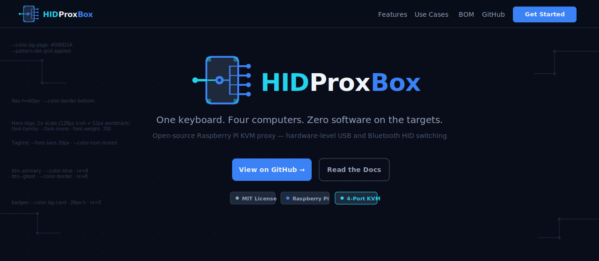
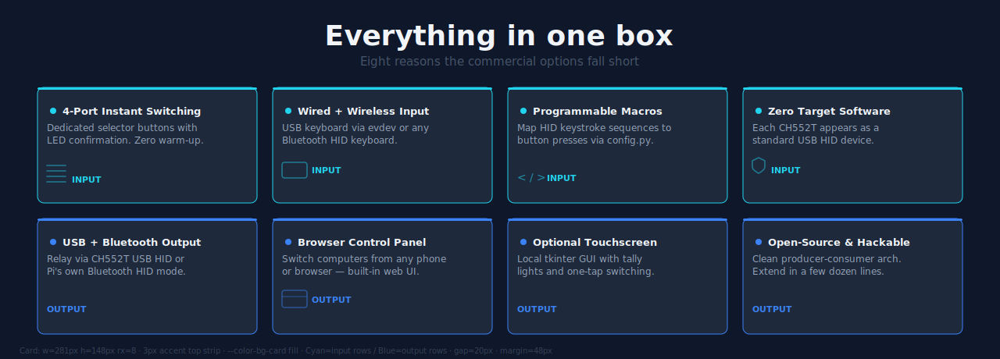
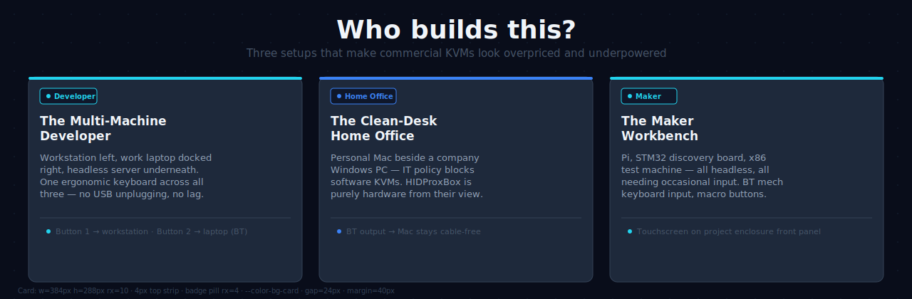
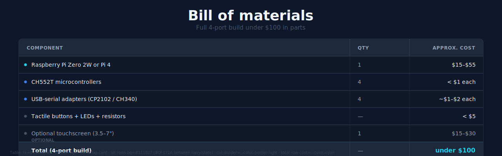
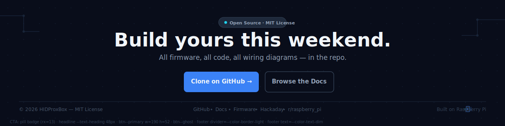

# HIDProxBox Web Design System

> Version 1.0 · April 2026  
> Handoff spec for the Full-Stack Web Developer.  
> Source of truth for brand decisions: `branding/BRAND_GUIDE.md`

---

## Quick-start

Copy `branding/tokens.css` into the project and import it at the top of your global stylesheet. All component styles in this spec are expressed as references to those tokens.

```html
<link rel="stylesheet" href="/branding/tokens.css">
```

Apply the dark theme (default) by ensuring `<html>` has no `data-theme` attribute, or set `data-theme="dark"`. For light mode: `<html data-theme="light">`.

---

## 1. Design Tokens

All values live in `branding/tokens.css`. Below is the token inventory for quick reference.

### 1.1 Color

| Token | Dark value | Light value | Role |
|---|---|---|---|
| `--color-bg-page` | `#090D1A` | `#F8FAFC` | Page background |
| `--color-bg-surface` | `#0F172A` | `#F1F5F9` | Section / surface |
| `--color-bg-card` | `#1E293B` | `#FFFFFF` | Card / box fill |
| `--color-bg-row-alt` | `#111827` | `#F8FAFC` | Alternating table rows |
| `--color-cyan` | `#22D3EE` | `#0891B2` | Input / source / active |
| `--color-blue` | `#3B82F6` | `#2563EB` | Output / CTA / interactive |
| `--color-text-primary` | `#F1F5F9` | `#0F172A` | Primary text |
| `--color-text-muted` | `#94A3B8` | `#475569` | Secondary / body text |
| `--color-text-dim` | `#475569` | `#94A3B8` | Caption / tertiary |
| `--color-border` | `#334155` | `#E2E8F0` | Dividers, card edges |
| `--color-border-light` | `#1E293B` | `#F1F5F9` | Subtle inner borders |

**Semantic rule:** Cyan = input / source / active selection. Blue = output / destination / primary action. Never reverse these roles.

### 1.2 Typography

#### Font families

```css
--font-mono: 'JetBrains Mono', 'Fira Code', 'Courier New', monospace;
--font-sans: Inter, system-ui, -apple-system, BlinkMacSystemFont, 'Segoe UI', Helvetica, Arial, sans-serif;
```

Add these to the page `<head>` (Google Fonts or self-hosted):

```html
<link rel="preconnect" href="https://fonts.googleapis.com">
<link href="https://fonts.googleapis.com/css2?family=Inter:wght@400;500;600;700&family=JetBrains+Mono:wght@400;700&display=swap" rel="stylesheet">
```

#### Type scale

| Token | Clamp range | Use |
|---|---|---|
| `--text-hero` | 52 → 88 px | Hero wordmark, section-hero headings |
| `--text-heading` | 34 → 56 px | Section headings |
| `--text-subheading` | 20 → 30 px | Sub-sections, card group labels |
| `--text-lead` | 17 → 20 px | Introductory / hero body copy |
| `--text-body` | 15 → 17 px | Feature descriptions, prose |
| `--text-caption` | 11 → 13 px | Badges, labels, footnotes |
| `--text-code` | 13 → 15 px | Code snippets, terminal output |

#### Logo wordmark — three-color split

Always render the logo wordmark as three distinct spans. Never merge or recolor arbitrarily.

```html
<!-- Dark background -->
<span class="font-mono font-bold" style="color:#22D3EE">HID</span>
<span class="font-mono font-bold" style="color:#F1F5F9">Prox</span>
<span class="font-mono font-bold" style="color:#3B82F6">Box</span>

<!-- Light background — swap to higher-contrast variants -->
<span class="font-mono font-bold" style="color:#0891B2">HID</span>
<span class="font-mono font-bold" style="color:#0F172A">Prox</span>
<span class="font-mono font-bold" style="color:#2563EB">Box</span>
```

#### Section heading anatomy

```
[36–56 px bold] Section title          → --color-text-primary
[15–17 px reg]  One-line sub-title     → --color-text-dim
```

Top margin above section title: `var(--section-py)` (60–120 px).  
Bottom margin before first component: 40–56 px.

### 1.3 Spacing

All spacing uses an **8 px base unit**. Use tokens from `--space-1` (4 px) through `--space-32` (128 px). Do not hard-code ad-hoc pixel values — pick the nearest token.

Typical cadences:

| Context | Token |
|---|---|
| Icon ↔ label gap | `--space-2` (8 px) |
| Card internal padding | `--space-6` (24 px) |
| Card-to-card gap | `--space-5` (20 px) |
| Section side margins | `--grid-padding` (clamp 16→48 px) |
| Vertical section rhythm | `--section-py` (clamp 60→120 px) |

### 1.4 Grid

```
max-width: var(--grid-max-width)  /* 1280 px */
padding-inline: var(--grid-padding) /* clamp(16px, 4vw, 48px) */
columns: 12
gutter: var(--grid-gap)  /* 24 px */
```

Use a CSS grid layout:

```css
.grid-12 {
  display: grid;
  grid-template-columns: repeat(12, 1fr);
  gap: var(--grid-gap);
}
```

Standard column spans: hero text = 10 col (offset 1), feature cards = 3 col each, use-case cards = 4 col each, BOM table = 12 col.

---

## 2. Background Pattern

Large surfaces (hero, CTA) use the dot-grid texture:

```css
.bg-hero {
  background-color: var(--color-bg-page);
  background-image: var(--pattern-dot-grid);
}
```

The pattern is a 40×40 px SVG tile with a single `0.8 px` circle at center, color `#1E2D45`, opacity `0.85`. On light mode the dot color switches to `#CBD5E1` at `0.6` opacity (see `tokens.css`).

Circuit trace accents (thin 90° polylines with endpoint dots) may be applied at page corners for texture. Color: `#1E2D45`, stroke-width `1.5`, opacity `0.7`. Keep them clearly subordinate to content.

---

## 3. Component Library

### 3.1 Navigation Bar

**Mockup:** `branding/mockup-hero.svg` (top 60 px)

```
Height:           60 px
Background:       --color-bg-page at 96% opacity (allows blur/glass effect)
Border-bottom:    1px solid --color-border at 60% opacity
Logo:             branding/logo-dark.svg at ~43 px height, 16px left margin
Nav links:        --font-sans 14px · --color-text-muted · 28px right gap
CTA button:       btn--primary · 34px height · 16px px
Position:         sticky top-0, z-index 50
```

```html
<nav class="navbar">
  
  <a href="#features">Features</a>
  <a href="#usecases">Use Cases</a>
  <a href="#bom">BOM</a>
  <a href="https://github.com/…">GitHub</a>
  <a href="#" class="btn btn--primary">Get Started</a>
</nav>
```

---

### 3.2 Hero Section

**Mockup:** `branding/mockup-hero.svg`



**Layout:**
```
Background:     --color-bg-page + --pattern-dot-grid
Min height:     560 px
Content:        centered column, max-width 860 px
Vertical align: center (padding-top ~80 px below nav, padding-bottom 80 px)
```

**Content stack (top → bottom):**

```
1. Logo mark + wordmark        → branding/logo-dark.svg at 2× (128 px height)
   — font: --font-mono, 52 px, weight 700, letter-spacing -1 px
   — three-color split: HID=#22D3EE  Prox=#F1F5F9  Box=#3B82F6

2. Tagline                     → 20 px, --color-text-muted, centered
   "One keyboard. Four computers. Zero software on the targets."

3. Sub-tagline                 → 14 px, --color-text-dim, centered
   "Open-source Raspberry Pi KVM proxy — hardware-level USB and Bluetooth HID switching"

4. CTA row (gap: 16 px)
   [View on GitHub →]          → btn--primary  170×48 px  rx=8
   [Read the Docs]             → btn--ghost    150×48 px  rx=8

5. Status badges (gap: 10 px, top margin 16 px)
   • MIT License               → .badge         (dot: --color-text-dim)
   • Raspberry Pi              → .badge--blue    (dot: --color-blue)
   • 4-Port KVM                → .badge--cyan    (dot: --color-cyan)
```

---

### 3.3 Feature Grid

**Mockup:** `branding/mockup-features.svg`



**Layout:** 4 columns on desktop, 2 columns on tablet, 1 column on mobile.

```
Background:   --color-bg-surface (Navy)
Card width:   span 3 / 12 cols (≈ 281 px at max-width)
Card height:  auto (min 148 px)
Card gap:     var(--space-5) = 20 px
Section padding: var(--section-py)
```

**Card anatomy:**

```
┌──────────────────────────────────┐  ← 3 px top accent strip (cyan or blue)
│ ● Title text                 14px │  ← leading dot 8 px · title font-weight 600
│                                   │
│   Body description           12px │  ← 2 lines · --color-text-muted
│   Second line                     │
│                                   │
│   CATEGORY LABEL            11px  │  ← all-caps · --color-cyan or --color-blue
└──────────────────────────────────┘
```

**Accent rule:**
- Row 1 (Input features) → `--color-cyan` top strip + dot
- Row 2 (Output/control features) → `--color-blue` top strip + dot

```html
<!-- Input card -->
<div class="card card--cyan">
  <h3>4-Port Instant Switching</h3>
  <p>Dedicated selector buttons with LED confirmation. Zero warm-up.</p>
  <span class="text-caption" style="color:var(--color-cyan)">INPUT</span>
</div>

<!-- Output card -->
<div class="card card--blue">
  <h3>USB + Bluetooth Output</h3>
  <p>Relay via CH552T USB HID or Pi's own Bluetooth HID mode.</p>
  <span class="text-caption" style="color:var(--color-blue)">OUTPUT</span>
</div>
```

**All 8 features:**

| # | Category | Title | Body |
|---|---|---|---|
| 1 | INPUT (cyan) | 4-Port Instant Switching | Dedicated selector buttons with LED confirmation. Zero warm-up. |
| 2 | INPUT (cyan) | Wired + Wireless Input | USB keyboard via evdev or any Bluetooth HID keyboard. |
| 3 | INPUT (cyan) | Programmable Macros | Map HID keystroke sequences to button presses via `config.py`. |
| 4 | INPUT (cyan) | Zero Target Software | Each CH552T appears as a standard USB HID device — no drivers. |
| 5 | OUTPUT (blue) | USB + Bluetooth Output | Relay via CH552T HID devices or Pi's BT keyboard mode. |
| 6 | OUTPUT (blue) | Browser Control Panel | Switch computers from any phone or browser at `:8080`. |
| 7 | OUTPUT (blue) | Optional Touchscreen | Local tkinter GUI with tally lights and one-tap switching. |
| 8 | OUTPUT (blue) | Open-Source & Hackable | Producer-consumer architecture — extend in a few dozen lines. |

---

### 3.4 Use-Case Cards

**Mockup:** `branding/mockup-usecases.svg`



**Layout:** 3 equal columns on desktop, 1 column on mobile.

```
Background:   --color-bg-page + --pattern-dot-grid
Card width:   span 4 / 12 cols (≈ 384 px at max-width)
Card height:  auto (min 288 px)
Card gap:     var(--space-6) = 24 px
```

**Card anatomy:**

```
┌──────────────────────────────────┐  ← 4 px top accent strip
│ [Category badge]         26 px   │  ← pill: rx 4 · stroke accent color
│                                   │
│ Title line 1             17px 700 │
│ Title line 2                      │
│                                   │
│ Body paragraph           13px     │  ← 4-5 lines · --color-text-muted
│ ...                               │
│──────────────────────────────────│  ← --color-border divider
│ ● Detail callout         11px     │  ← dot in accent color
└──────────────────────────────────┘
```

**Three cards:**

| # | Accent | Badge | Title | Callout |
|---|---|---|---|---|
| 1 | Cyan | Developer | The Multi-Machine Developer | Button 1 → workstation · Button 2 → laptop (BT) |
| 2 | Blue | Home Office | The Clean-Desk Home Office | BT output → Mac stays cable-free |
| 3 | Cyan | Maker | The Maker Workbench | Touchscreen on project enclosure front panel |

---

### 3.5 BOM Table

**Mockup:** `branding/mockup-bom.svg`



**Layout:** full-width (12 cols), inside a single card container.

```
Background:   --color-bg-surface (Navy)
Container:    rx=8 · border 1px --color-border · max-width 1184 px
Header row:   h=44 px · bg=--color-bg-card · font 12px 700 letter-spacing 0.06em all-caps --color-text-muted
Data rows:    h=44 px · alternating --color-bg-surface / --color-bg-row-alt
Total row:    h=44 px · bg=--color-bg-card · cost value in --color-cyan
```

**Column widths (at 1184 px table):**

| Column | Width | Align | Notes |
|---|---|---|---|
| Component | ~71% (≈ 844 px) | Left | Leading accent dot: cyan for core, blue for USB output, dim for optional/passive |
| Qty | ~13% (≈ 152 px) | Left | Plain number or `—` |
| Approx. Cost | ~16% (≈ 188 px) | Right | Right-aligned; total cell uses `--color-cyan` |

**HTML structure:**

```html
<div class="card" style="padding:0; overflow:hidden;">
  <table style="width:100%; border-collapse:collapse;">
    <thead>
      <tr style="background:var(--color-bg-card);">
        <th>Component</th>
        <th>Qty</th>
        <th style="text-align:right">Approx. Cost</th>
      </tr>
    </thead>
    <tbody>
      <tr class="row-alt"><td>…</td>…</tr>
      <!-- alternate rows use --color-bg-row-alt -->
    </tbody>
    <tfoot>
      <tr style="background:var(--color-bg-card);">
        <td colspan="2">Total (4-port build)</td>
        <td style="color:var(--color-cyan); text-align:right; font-weight:700">under $100</td>
      </tr>
    </tfoot>
  </table>
</div>
```

**Leading dot colors:**
- Raspberry Pi → `--color-cyan` (core compute, input side)
- CH552T + USB serial → `--color-blue` (USB output side)
- Buttons / LEDs / touchscreen → `--color-text-dim` (passive / optional)

---

### 3.6 CTA + Footer

**Mockup:** `branding/mockup-cta-footer.svg`



**CTA section:**

```
Background:    --color-bg-page + --pattern-dot-grid + corner circuit traces
Padding:       var(--section-py) top, 80 px bottom
Content:       centered column, max-width 700 px
```

Content stack:

```
1. Pre-heading pill badge
   "Open Source · MIT License"
   → .badge · rx=13 (pill) · border --color-border · dot --color-cyan
   → margin-bottom 24 px

2. Headline          48 px  700  --color-text-primary
   "Build yours this weekend."

3. Sub-line          17 px  400  --color-text-muted
   "All firmware, all code, all wiring diagrams — in the repo."
   → margin-top 12 px

4. Button row (gap 16 px, margin-top 32 px)
   [Clone on GitHub →]  → btn--primary  190×52 px
   [Browse the Docs]    → btn--ghost    174×52 px
```

**Footer:**

```
Background:    --color-bg-page (no pattern)
Top border:    1 px solid --color-border-light
Padding:       32 px vertical
```

```
Left:    "© 2026 HIDProxBox — MIT License"    → 12 px --color-text-dim
Center:  GitHub · Docs · Firmware · Hackaday · r/raspberry_pi
         links separated by 4 px circle dots (--color-border)
Right:   "Built on Raspberry Pi" + icon mark  → 12 px --color-border
```

---

## 4. Dark / Light Mode

### Switching

The site ships dark by default. Light mode is opt-in. Toggle via:

```js
document.documentElement.dataset.theme = 'light';  // enable
delete document.documentElement.dataset.theme;      // back to dark
```

Persist the preference in `localStorage`:

```js
const saved = localStorage.getItem('theme');
if (saved) document.documentElement.dataset.theme = saved;
```

### Logo asset swap

| Context | Asset |
|---|---|
| Dark background | `branding/logo-dark.svg` |
| Light background | `branding/logo-light.svg` |

Swap with:

```js
const logo = document.querySelector('.nav-logo');
const isDark = !document.documentElement.dataset.theme;
logo.src = isDark ? '/branding/logo-dark.svg' : '/branding/logo-light.svg';
```

### Light-mode card treatment

On light mode, cards lose their dark fill and gain a `box-shadow` instead of a visible border for depth:

```css
[data-theme="light"] .card {
  background: var(--color-bg-card);   /* #FFFFFF */
  border-color: var(--color-border);  /* #E2E8F0 */
  box-shadow: var(--shadow-card);
}
```

Accent colors automatically shift to the 600-series variants via token overrides in `tokens.css`. No additional code required.

---

## 5. Badge / Pill Reference

Badges follow the brand guide pill style exactly.

```
Background:    --color-bg-card
Border:        1 px solid [accent or --color-border]
Border-radius: var(--radius-sm) = 4 px (badge) / var(--radius-full) = 9999 px (pill)
Padding:       4 px 10 px
Font:          --font-sans 12 px weight 600
Leading dot:   6 px circle in accent color
```

```html
<span class="badge">Default</span>
<span class="badge badge--cyan">Input · USB</span>
<span class="badge badge--blue">Output · BT</span>
```

---

## 6. Breakpoints

| Name | Width | Grid behaviour |
|---|---|---|
| `sm` | 640 px | 1-col layout everywhere |
| `md` | 768 px | Feature grid: 2 cols; use-case: 1 col |
| `lg` | 1024 px | Feature grid: 4 cols; use-case: 3 cols |
| `xl` | 1280 px | Full desktop layout; container hits max-width |

---

## 7. Accessibility

- All text combinations must meet WCAG AA contrast (4.5 : 1 for body, 3 : 1 for large text).
- `--color-text-muted` (#94A3B8) on `--color-bg-page` (#090D1A) = **9.4 : 1** ✓
- `--color-text-primary` (#F1F5F9) on `--color-bg-card` (#1E293B) = **10.6 : 1** ✓
- `--color-cyan` (#22D3EE) on `--color-bg-page` (#090D1A) = **9.1 : 1** ✓
- `--color-blue` (#3B82F6) on `--color-bg-page` (#090D1A) = **4.6 : 1** ✓
- Never use `--color-text-dim` (#475569) alone on `--color-bg-page` for body text — it falls below 3 : 1. Reserve for captions paired with nearby primary text.

---

## 8. Asset Inventory

| File | Purpose | Dimensions |
|---|---|---|
| `branding/tokens.css` | CSS design tokens | — |
| `branding/BRAND_GUIDE.md` | Full brand reference | — |
| `branding/icon.svg` | Favicon / avatar | 64×64 base, scalable |
| `branding/logo-dark.svg` | Logo on dark backgrounds | 252×64 |
| `branding/logo-light.svg` | Logo on light backgrounds | 252×64 |
| `branding/social-preview.svg` | GitHub social preview | 1280×640 |
| `branding/readme-banner.svg` | README header | 1280×200 |
| `branding/mockup-hero.svg` | Hero section mockup | 1280×560 |
| `branding/mockup-features.svg` | Feature grid mockup | 1280×460 |
| `branding/mockup-usecases.svg` | Use-case cards mockup | 1280×420 |
| `branding/mockup-bom.svg` | BOM table mockup | 1280×400 |
| `branding/mockup-cta-footer.svg` | CTA + footer mockup | 1280×320 |

---

*This design system is the handoff spec from the Brand Designer to the Full-Stack Web Developer. If a component detail is unclear, refer to the corresponding SVG mockup file for the ground truth visual.*
